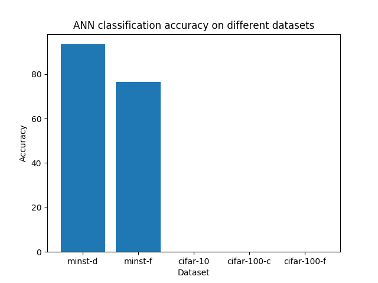
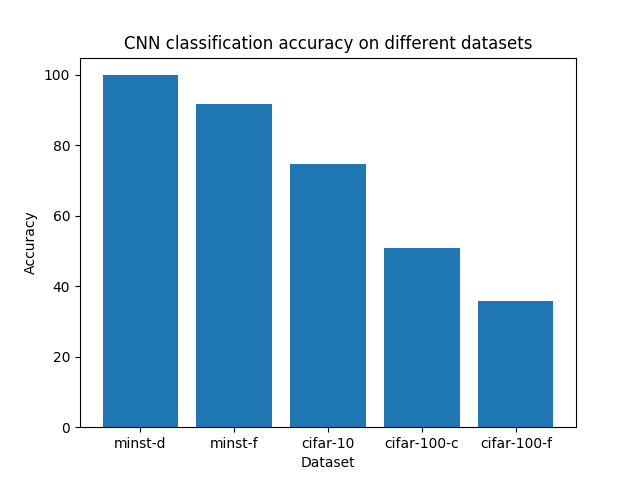

# Lab 2 Report
Pranav Nair
nair51@purdue.edu

Repo: https://github.com/Automage/CS390NIP-Lab2

## Resources
https://keras.io/api/layers/regularization_layers/dropout

https://www.cs.toronto.edu/~kriz/cifar.html

http://d2l.ai/chapter_convolutional-modern/vgg.html

https://machinelearningmastery.com/how-to-develop-a-cnn-from-scratch-for-cifar-10-photo-classification/

## Questions
### How is a CNN superior to standard ANNs for image processing?
CNNs are superior to standard ANNs due to their ability to extract data more relevant to that of an image. By considering the relationship between each pixel's neighbors (via filters and convolutions), the data provided to the fully connected layer is more meaningful compared to a one dimensional vector of pixels, leading networks to 'learn' better.

### Why do we sometimes use pooling in CNNs?
Pooling is used to reduce the dimensionality of the image tensor from convolution layers by removing unwanted data. This allows the processing of further layers to be less demanding on the processor.

### Why do you think the cifar datasets are harder than mnist?
Cifar datasets have a larger input compared to the MINST dataset – the dimensions of the images are larger as well as containing a color component, adding an extra dimension to the tensor. Due to this, networks are unable to classify the more complex cifar dataset as well as the simpler MINST dataset, which contain 2 dimensional tensors as input.

## CNN hyperparameters and architecture
There were several optimizations made to the standard CNN discussed in lecture in order to improve accuracy. 

The first was to implement the concept of dropout, which would help the probability of the network overfitting the training data. Two dropout layers were added, one before the first fully connected layer, and before the second fully connected layer.

A batch size of 64 was also used in order to increase the effectiveness of the training process of the network. 

The final optimization made was to update the architecture of the network. Specifically, 3 VGG blocks were added, each containing two convolution layers and one max pooling layer. The filter size was increased gradually between the three layers, 32, 64 and 128 respectively. 

### Hyperparameters
- loss type: categorical crossentropy, Adam optimizer as the optimizer
- convolution layers with size 32, 64 and 128 respectively
- max pooling size of (2,2)
- epochs: 10, batch-size: 64
- 0.2 dropout rate
- kernel size was (3,3)
- Two fully connected layers with 10 and 512 nodes, respectively.s
- ReLu activation was used in the convolution and fully connected layers, expect the final dense layer which used softmax.

## ANN Output


### MINST-d
```
Classifier accuracy: 93.430000%
F - scores:  [0.958 0.978 0.93  0.926 0.931 0.922 0.947 0.935 0.901 0.907]

 [[  960.    0.    11.     4.     2.    12.    13.     0.    15.     8.     1025.]
 [    0.  1114.     3.     2.     0.     1.     3.    13.     2.     6.     1144.]
 [    1.     4.   953.    10.    10.     2.     7.    23.     5.     2.     1017.]
 [    0.     1.    19.   941.     0.    28.     0.     9.    12.    12.     1022.]
 [    0.     1.     5.     2.   923.     6.     6.    10.    15.    32.     1000.]
 [    4.     1.     0.    10.     0.   797.     6.     3.    14.     1.     836.]
 [    8.     4.    12.     2.    10.    17.   918.     0.     9.     0.     980.]
 [    2.     0.     5.     8.     2.     5.     1.   931.     5.     5.     964.]
 [    3.    10.    21.    19.     3.    19.     4.     2.   871.     8.     960.]
 [    2.     0.     3.    12.    32.     5.     0.    37.    26.   935.     1052.]
 [  980.  1135.  1032.  1010.   982.   892.   958.  1028.   974.  1009.     10000.]]
```
### MINST-f
```
Classifier accuracy: 76.590000%
F - scores:  [0.723 0.956 0.631 0.762 0.609 0.876 0.401 0.889 0.929 0.872]

Confusion Matrix:
[[  633.     0.     7.     5.     0.     1.   106.     0.     0.     0.     752.]
 [    3.   932.     0.     9.     1.     0.     3.     0.     1.     0.     949.]
 [   18.    12.   634.     6.   163.     0.   156.     0.    19.     0.     1008.]
 [  133.    40.     8.   805.    22.     1.    91.     0.    10.     2.     1112.]
 [   27.    13.   264.   128.   750.     0.   270.     0.    12.     0.     1464.]
 [    0.     0.     0.     0.     0.   872.     2.    39.     9.    68.     990.]
 [  171.     2.    81.    46.    57.     0.   347.     0.    28.     0.     732.]
 [    0.     0.     0.     0.     0.    60.     0.   898.     2.    60.     1020.]
 [   14.     1.     6.     1.     7.     5.    25.     0.   918.     0.     977.]
 [    1.     0.     0.     0.     0.    61.     0.    63.     1.   870.     996.]
 [ 1000.  1000.  1000.  1000.  1000.  1000.  1000.  1000.  1000.  1000.     10000.]]
```
### Cifar-10
```
Classifier accuracy: 10.000000%
F - scores:  [  nan 0.182   nan   nan   nan   nan   nan   nan   nan   nan]

Confusion Matrix:
[[    0.     0.     0.     0.     0.     0.     0.     0.     0.     0.
      0.]
 [ 1000.  1000.  1000.  1000.  1000.  1000.  1000.  1000.  1000.  1000.
  10000.]
 [    0.     0.     0.     0.     0.     0.     0.     0.     0.     0.
      0.]
 [    0.     0.     0.     0.     0.     0.     0.     0.     0.     0.
      0.]
 [    0.     0.     0.     0.     0.     0.     0.     0.     0.     0.
      0.]
 [    0.     0.     0.     0.     0.     0.     0.     0.     0.     0.
      0.]
 [    0.     0.     0.     0.     0.     0.     0.     0.     0.     0.
      0.]
 [    0.     0.     0.     0.     0.     0.     0.     0.     0.     0.
      0.]
 [    0.     0.     0.     0.     0.     0.     0.     0.     0.     0.
      0.]
 [    0.     0.     0.     0.     0.     0.     0.     0.     0.     0.
      0.]
 [ 1000.  1000.  1000.  1000.  1000.  1000.  1000.  1000.  1000.  1000.
  10000.]]
```
### Cifar-100-c
```
Classifier accuracy: 1.000000%
F - scores:  [ nan  nan  nan  nan  nan  nan  nan  nan  nan  nan  nan  nan  nan  nan
  nan  nan 0.02  nan  nan  nan  nan  nan  nan  nan  nan  nan  nan  nan
  nan  nan  nan  nan  nan  nan  nan  nan  nan  nan  nan  nan  nan  nan
  nan  nan  nan  nan  nan  nan  nan  nan  nan  nan  nan  nan  nan  nan
  nan  nan  nan  nan  nan  nan  nan  nan  nan  nan  nan  nan  nan  nan
  nan  nan  nan  nan  nan  nan  nan  nan  nan  nan  nan  nan  nan  nan
  nan  nan  nan  nan  nan  nan  nan  nan  nan  nan  nan  nan  nan  nan
  nan  nan]
Confusion Matrix:
[[    0.     0.     0. ...     0.     0.     0.]
 [    0.     0.     0. ...     0.     0.     0.]
 [    0.     0.     0. ...     0.     0.     0.]
 ...
 [    0.     0.     0. ...     0.     0.     0.]
 [    0.     0.     0. ...     0.     0.     0.]
 [  100.   100.   100. ...   100.   100. 10000.]]
```
### Cifar-100-f
```
Classifier accuracy: 5.000000%
F - scores:  [  nan   nan   nan   nan 0.095   nan   nan   nan   nan   nan   nan   nan
   nan   nan   nan   nan   nan   nan   nan   nan]
Confusion Matrix:
[[    0.     0.     0.     0.     0.     0.     0.     0.     0.     0.
      0.     0.     0.     0.     0.     0.     0.     0.     0.     0.
      0.]
 [    0.     0.     0.     0.     0.     0.     0.     0.     0.     0.
      0.     0.     0.     0.     0.     0.     0.     0.     0.     0.
      0.]
 [    0.     0.     0.     0.     0.     0.     0.     0.     0.     0.
      0.     0.     0.     0.     0.     0.     0.     0.     0.     0.
      0.]
 [    0.     0.     0.     0.     0.     0.     0.     0.     0.     0.
      0.     0.     0.     0.     0.     0.     0.     0.     0.     0.
      0.]
 [  500.   500.   500.   498.   500.   500.   500.   500.   500.   500.
    500.   500.   500.   500.   500.   500.   500.   500.   500.   500.
   9998.]
 [    0.     0.     0.     0.     0.     0.     0.     0.     0.     0.
      0.     0.     0.     0.     0.     0.     0.     0.     0.     0.
      0.]
 [    0.     0.     0.     0.     0.     0.     0.     0.     0.     0.
      0.     0.     0.     0.     0.     0.     0.     0.     0.     0.
      0.]
 [    0.     0.     0.     0.     0.     0.     0.     0.     0.     0.
      0.     0.     0.     0.     0.     0.     0.     0.     0.     0.
      0.]
 [    0.     0.     0.     0.     0.     0.     0.     0.     0.     0.
      0.     0.     0.     0.     0.     0.     0.     0.     0.     0.
      0.]
 [    0.     0.     0.     0.     0.     0.     0.     0.     0.     0.
      0.     0.     0.     0.     0.     0.     0.     0.     0.     0.
      0.]
 [    0.     0.     0.     0.     0.     0.     0.     0.     0.     0.
      0.     0.     0.     0.     0.     0.     0.     0.     0.     0.
      0.]
 [    0.     0.     0.     0.     0.     0.     0.     0.     0.     0.
      0.     0.     0.     0.     0.     0.     0.     0.     0.     0.
      0.]
 [    0.     0.     0.     2.     0.     0.     0.     0.     0.     0.
      0.     0.     0.     0.     0.     0.     0.     0.     0.     0.
      2.]
 [    0.     0.     0.     0.     0.     0.     0.     0.     0.     0.
      0.     0.     0.     0.     0.     0.     0.     0.     0.     0.
      0.]
 [    0.     0.     0.     0.     0.     0.     0.     0.     0.     0.
      0.     0.     0.     0.     0.     0.     0.     0.     0.     0.
      0.]
 [    0.     0.     0.     0.     0.     0.     0.     0.     0.     0.
      0.     0.     0.     0.     0.     0.     0.     0.     0.     0.
      0.]
 [    0.     0.     0.     0.     0.     0.     0.     0.     0.     0.
      0.     0.     0.     0.     0.     0.     0.     0.     0.     0.
      0.]
 [    0.     0.     0.     0.     0.     0.     0.     0.     0.     0.
      0.     0.     0.     0.     0.     0.     0.     0.     0.     0.
      0.]
 [    0.     0.     0.     0.     0.     0.     0.     0.     0.     0.
      0.     0.     0.     0.     0.     0.     0.     0.     0.     0.
      0.]
 [    0.     0.     0.     0.     0.     0.     0.     0.     0.     0.
      0.     0.     0.     0.     0.     0.     0.     0.     0.     0.
      0.]
 [  500.   500.   500.   500.   500.   500.   500.   500.   500.   500.
    500.   500.   500.   500.   500.   500.   500.   500.   500.   500.
  10000.]]
```

## CNN Output



### MINST-d
```
Classifier accuracy: 99.190000%
F - scores:  [0.995 0.993 0.992 0.991 0.993 0.99  0.991 0.99  0.994 0.989]

Confusion Matrix:
[[  975.     0.     1.     0.     0.     0.     2.     0.     0.     1.     979.]
 [    0.  1129.     2.     0.     0.     0.     3.     3.     0.     1.     1138.]
 [    0.     0.  1018.     0.     0.     0.     0.     1.     1.     0.     1020.]
 [    0.     2.     1.  1007.     0.     7.     0.     1.     3.     2.     1023.]
 [    0.     0.     0.     0.   971.     0.     1.     0.     0.     2.     974.]
 [    0.     0.     0.     2.     0.   880.     2.     0.     1.     0.     885.]
 [    4.     2.     0.     0.     1.     1.   949.     0.     0.     0.     957.]
 [    1.     2.    10.     0.     0.     0.     0.  1021.     0.     1.     1035.]
 [    0.     0.     0.     1.     0.     2.     1.     0.   968.     1.     973.]
 [    0.     0.     0.     0.    10.     2.     0.     2.     1.  1001.     1016.]
 [  980.  1135.  1032.  1010.   982.   892.   958.  1028.   974.  1009.     10000.]]
```
### MINST-f
```
Classifier accuracy: 91.660000%
F - scores:  [0.873 0.988 0.871 0.913 0.871 0.983 0.757 0.962 0.984 0.962]

Confusion Matrix:
[[  897.     0.    19.    16.     0.     0.   120.     0.     3.     0.     1055.]
 [    0.   982.     1.     3.     0.     0.     1.     0.     0.     0.     987.]
 [   17.     1.   850.     7.    35.     0.    40.     0.     1.     0.     951.]
 [   13.    12.    15.   929.    31.     0.    33.     0.     1.     0.     1034.]
 [    0.     0.    51.    22.   862.     0.    45.     0.     0.     0.     980.]
 [    1.     0.     0.     0.     0.   979.     0.     4.     2.     6.     992.]
 [   69.     3.    64.    19.    72.     0.   751.     0.     5.     0.     983.]
 [    0.     0.     0.     0.     0.    11.     0.   952.     1.    15.     979.]
 [    3.     2.     0.     3.     0.     0.    10.     0.   986.     1.     1005.]
 [    0.     0.     0.     1.     0.    10.     0.    44.     1.   978.     1034.]
 [ 1000.  1000.  1000.  1000.  1000.  1000.  1000.  1000.  1000.  1000.     10000.]]
```
### Cifar-10
```
Classifier accuracy: 74.590000%
F - scores:  [0.779 0.86  0.647 0.557 0.695 0.65  0.791 0.804 0.85  0.826]

Confusion Matrix:
[[  840.    15.    80.    28.    28.    12.     8.    20.    94.    32.     1157.]
 [   18.   927.     6.    11.     6.     5.     5.     4.    37.   138.     1157.]
 [   37.     6.   631.    63.    62.    63.    43.    30.    12.     4.     951.]
 [   17.     3.    67.   589.    83.   198.    58.    64.    19.    18.     1116.]
 [   12.     1.    67.    37.   637.    26.    14.    33.     6.     1.     834.]
 [    2.     3.    54.   146.    29.   631.    24.    44.     3.     6.     942.]
 [    9.     2.    65.    76.    82.    24.   834.     9.     4.     4.     1109.]
 [    5.     0.    15.    34.    69.    35.     3.   790.     4.     9.     964.]
 [   39.     9.    10.     6.     4.     2.     5.     2.   810.    18.     905.]
 [   21.    34.     5.    10.     0.     4.     6.     4.    11.   770.     865.]
 [ 1000.  1000.  1000.  1000.  1000.  1000.  1000.  1000.  1000.  1000.     10000.]]
```
### Cifar-100-c
```
Classifier accuracy: 50.860000%
F - scores:  [0.409 0.438 0.695 0.552 0.596 0.46  0.58  0.5   0.4   0.622 0.671 0.433
 0.344 0.271 0.608 0.282 0.348 0.778 0.591 0.509]
Confusion Matrix:
[[  188.    50.     1.     0.     1.     7.     4.     6.    22.     4.
     13.    12.    22.    14.     7.    34.    14.     6.     5.    10.
    420.]
 [   48.   193.     6.     4.    10.     7.     7.     7.     4.     7.
      9.     3.     6.    17.     8.    26.    10.     1.     2.     6.
    381.]
 [    0.    30.   382.    11.    71.     9.     6.    22.     2.     1.
      6.     4.     5.    14.    22.     1.     5.     2.     3.     3.
    599.]
 [    8.     8.     7.   273.    13.    56.    31.     7.     6.     1.
      1.     3.     4.    27.     9.    10.     9.     1.     7.     8.
    489.]
 [    1.    14.    16.    18.   260.     8.     6.     6.     2.     2.
      0.     3.     1.    16.     8.     1.     6.     2.     0.     3.
    373.]
 [   11.     8.     2.    61.     4.   236.    29.     2.    15.    15.
      7.    12.     9.    15.    15.    24.    12.     6.    29.    15.
    527.]
 [    9.     8.     5.    24.     4.    35.   273.     6.     2.     9.
      6.     2.     3.    12.    14.     9.     2.     4.     6.     9.
    442.]
 [   14.    21.    36.    12.    28.     9.    16.   280.    11.     2.
      2.    10.    14.    65.    16.    42.    21.     1.     5.    14.
    619.]
 [   29.     5.     3.     5.    17.    12.     2.    28.   215.     3.
     10.    31.    74.    33.    11.    35.    47.     5.     7.     3.
    575.]
 [   17.    11.     2.     4.     2.    14.    19.     6.     6.   353.
     42.    17.     4.     3.    11.    14.     9.    15.    37.    49.
    635.]
 [   12.    22.     2.     6.     4.     8.    11.     2.     5.    34.
    342.     6.     3.     7.     0.    14.     5.    20.     6.    10.
    519.]
 [   52.    19.     4.    15.    23.    17.    22.    21.   115.    13.
     10.   307.    98.    26.    25.    36.    78.     6.    13.    17.
    917.]
 [   20.     8.     2.     3.     3.     3.     4.    13.    27.     1.
      1.    16.   143.    13.     2.    29.    34.     3.     4.     3.
    332.]
 [    8.    16.     7.    12.    19.    20.    13.    20.     2.     0.
      2.     5.    11.   112.    12.    32.    18.     2.     6.    10.
    327.]
 [    4.    13.     7.    15.     8.    14.    15.     6.     5.     1.
      1.    11.    11.    13.   285.     6.    14.     0.     6.     3.
    438.]
 [   28.    29.     3.     2.     5.     2.     9.    29.    12.     3.
      3.    12.    12.    55.     7.   124.    16.     7.     5.    17.
    380.]
 [   39.    35.     5.    14.    13.    12.    14.    23.    36.     3.
      5.    21.    62.    35.    38.    32.   188.     4.     0.     1.
    580.]
 [    3.     2.     6.     4.     8.     2.     2.    11.     8.    16.
     32.    10.     1.     5.     2.    12.     7.   411.     6.     9.
    557.]
 [    3.     6.     2.     8.     2.    12.     7.     0.     5.    16.
      1.     8.     7.    12.     6.     8.     4.     2.   288.    77.
    474.]
 [    6.     2.     2.     9.     5.    17.    10.     5.     0.    16.
      7.     7.    10.     6.     2.    11.     1.     2.    65.   233.
    416.]
 [  500.   500.   500.   500.   500.   500.   500.   500.   500.   500.
    500.   500.   500.   500.   500.   500.   500.   500.   500.   500.
  10000.]]
```
### Cifar-100-f
```
Classifier accuracy: 35.700000%
F - scores:  [0.599 0.395 0.197 0.139 0.047 0.352 0.287 0.305 0.443 0.52  0.272 0.148
 0.321 0.313 0.263 0.269 0.308 0.488 0.126 0.275 0.622 0.413 0.299 0.321
 0.551 0.108 0.236 0.242 0.491 0.349 0.34  0.253 0.372 0.43  0.247 0.176
 0.414 0.26  0.211 0.406 0.326 0.636 0.211 0.295 0.04  0.199 0.215 0.446
 0.567 0.44  0.085 0.212 0.586 0.526 0.4     nan 0.525 0.319 0.5   0.316
 0.708 0.531 0.452 0.241 0.085 0.158 0.267 0.255 0.66  0.478 0.145 0.553
 0.074 0.304 0.178 0.6   0.596 0.18  0.095 0.287 0.034 0.358 0.684 0.333
 0.213 0.409 0.402 0.48  0.22  0.386 0.221 0.503 0.293 0.245 0.654 0.461
 0.234 0.277 0.195 0.42 ]

 Confusion Matrix:
[[   59.     0.     1. ...     0.     0.    97.]
 [    2.    49.     2. ...     1.     0.   148.]
 [    0.     1.    17. ...     4.     1.    73.]
 ...
 [    0.     0.    11. ...    21.     0.   115.]
 [    0.     1.     1. ...     0.    38.    81.]
 [  100.   100.   100. ...   100.   100. 10000.]]
```
